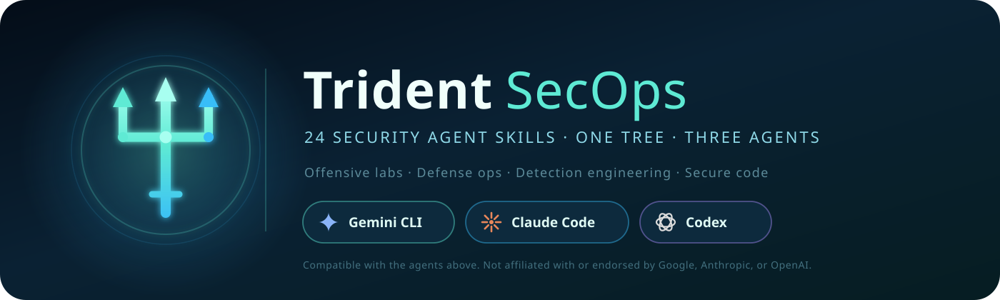

# Trident SecOps Skills



A curated collection of 24 `SKILL.md` capabilities for security work —
offensive security, SOC and detection engineering, cloud and Kubernetes
hardening, DFIR, threat intel, secure programming, reverse engineering,
prompt improvement, and multilingual communication.

The same skills run on three agents: **Gemini CLI**, **Claude Code**, and
**OpenAI Codex**. There is one canonical `skills/` tree; each platform reads
it through a thin adapter.

Repository URL:

```text
https://github.com/Garyson26/Trident-SecOps-Skills
```

## What is included

This repository contains 24 skills, grouped below.

### Cyber security automation

- `gemini-tool-orchestrator`: Translate natural-language intent into safe,
  scoped pipelines of nmap, nuclei, ffuf, semgrep, trivy, and friends.
- `ai-redteam`: Evaluate prompt injection, jailbreak, tool abuse, agent
  hijack, and RAG poisoning on LLM and agent systems you own.
- `threat-intel-fusion`: Collect, normalize, enrich, dedupe, and prioritize
  IOCs and actor profiles into STIX, Sigma, YARA, and blocklists.
- `cloud-security-automation`: AWS, Azure, GCP posture, IaC scanning, and
  drift-and-fix workflows shipped as code, not console clicks.
- `detection-engineering`: Author and tune Sigma, YARA, Suricata, KQL, SPL,
  and EQL detections with ATT&CK coverage and tests.
- `kubernetes-security`: Cluster hardening, admission control with
  Gatekeeper/Kyverno, runtime defense, and signed-image supply chain.
- `purple-team-automation`: Link Atomic Red Team, Caldera, and Stratus
  emulation to detection validation and coverage scoring.
- `osint-recon-automation`: Passive recon, asset graphing, and exposure
  monitoring for authorized scopes only.
- `api-security-automation`: REST, GraphQL, and gRPC assessment covering
  OWASP API Top 10, JWT abuse, BOLA, mass assignment, and replay.
- `forensics-triage`: DFIR across disk, memory, network, cloud, and
  identity with defensible timelines and chain of custody.
- `bug-bounty-workflow`: Scope-aware recon, dedupe, and high-signal
  reporting for HackerOne, Bugcrowd, Intigriti, and YesWeHack.
- `smart-contract-audit`: Solidity, Vyper, and Move audit with Slither,
  Foundry, Echidna, invariants, MEV, and bridge risk.

### Core security

- `offensive-security`: Plan authorized offensive security assessments.
- `exploit-development`: Analyze lab vulnerabilities and safe proof of
  concept workflows.
- `malware-reverse-engineering`: Triage suspicious artifacts and produce
  defensive findings.
- `devsecops`: Harden CI/CD, infrastructure, containers, and releases.
- `soc-operations`: Triage alerts, hunt threats, and produce incident notes.
- `cybersecurity-partner`: Act as a practical security reviewer and advisor.

### Engineering and language

- `go-programming`: Build, debug, test, and review idiomatic Go systems.
- `python-programming`: Build, test, type, package, and maintain Python code.
- `assembly-programming`: Read, write, explain, and debug low-level assembly.
- `prompt-enhancement`: Improve prompts, task specs, and agent instructions.
- `multilingual`: Translate, localize, and improve multilingual content.
- `claude-mythos-emulation`: Create Claude-like assistant behavior specs
  without identity claims or proprietary prompt copying.

## Install

| Agent | Method | Command |
| --- | --- | --- |
| Gemini CLI | extension | `gemini extensions install https://github.com/Garyson26/Trident-SecOps-Skills --consent` |
| Claude Code | plugin marketplace | `/plugin marketplace add Garyson26/Trident-SecOps-Skills` then `/plugin install trident-secops-skills@trident-secops` |
| Codex | installer script | `./install.sh codex` (or `./install.ps1 -Platform codex`) |

Full instructions, including manual and project-scoped installs, are in
[INSTALL.md](INSTALL.md).

### Why Codex needs a script

Gemini reads `skills/` and Claude's plugin manifest points at the same
directory, so both install straight from the repository. Codex discovers
skills under `.agents/skills`, so the installer copies the tree there.

## Documentation

Read the documentation set for installation details, usage patterns, and skill
knowledge:

- [Install](INSTALL.md)
- [Usage](USAGE.md)
- [Knowledge base](KNOWLEDGE_BASE.md)
- [Comparison](COMPARISON.md)
- [Contributing](CONTRIBUTING.md)
- [Security policy](SECURITY.md)
- [FAQ](FAQ.md)
- [Roadmap](ROADMAP.md)
- [Installation guide](docs/installation.md)
- [Skill catalog](docs/skill-catalog.md)
- [CLI usage](docs/cli-usage.md)
- [Security boundaries](docs/security-boundaries.md)
- [Cybersecurity workflows](docs/cybersecurity-workflows.md)
- [Programming workflows](docs/programming-workflows.md)
- [Prompting and multilingual workflows](docs/prompting-and-multilingual.md)
- [Development and maintenance](docs/development-and-maintenance.md)
- [Troubleshooting](docs/troubleshooting.md)

## Safety model

The cyber security skills are written for authorized, defensive, educational,
and lab-scoped work. They emphasize scope confirmation, safe proof, containment,
reporting, and remediation. They intentionally avoid unauthorized access,
stealth, persistence, credential theft, destructive activity, and malware
improvement.

## Repository layout

Each skill is self-contained:

```text
skills/
└── skill-name/
    ├── SKILL.md
    └── agents/
        └── openai.yaml
```

`skills/` is the single canonical tree — there are no duplicate copies
elsewhere in the repository. Every skill is a directory holding a `SKILL.md`
whose YAML frontmatter supplies `name` and `description`, which is the format
Gemini CLI, Claude Code, and Codex all read. The `agents/openai.yaml` files
provide Codex interface metadata and are ignored by the other two agents.

Run `bash scripts/validate.sh` to check the tree.

## Source references

The installation docs were checked against each agent's published skill
format. Gemini references were verified on May 9, 2026; Claude and Codex
references on September 16, 2026.

Gemini CLI:

- Agent Skills overview:
  https://geminicli.com/docs/cli/skills/
- Managing Agent Skills:
  https://geminicli.com/docs/cli/using-agent-skills/
- Extension reference:
  https://geminicli.com/docs/extensions/reference/
- Command reference:
  https://google-gemini.github.io/gemini-cli/docs/cli/cli-reference.html

Claude Code:

- Plugin reference:
  https://code.claude.com/docs/en/plugins-reference
- Plugin marketplaces:
  https://code.claude.com/docs/en/plugin-marketplaces

Codex:

- Building skills:
  https://learn.chatgpt.com/docs/build-skills
